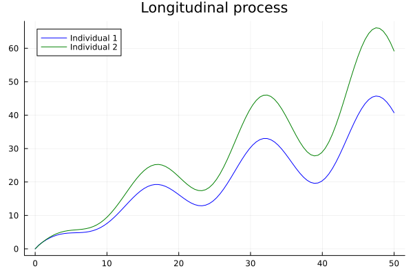
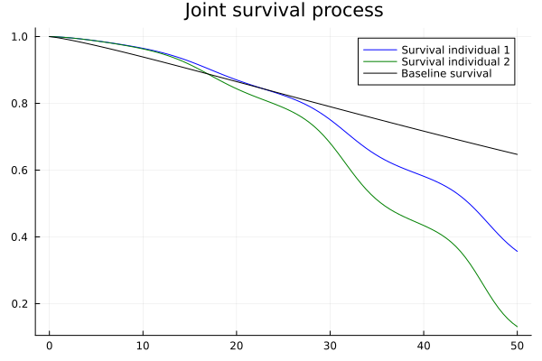
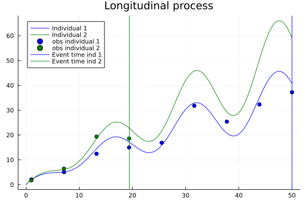
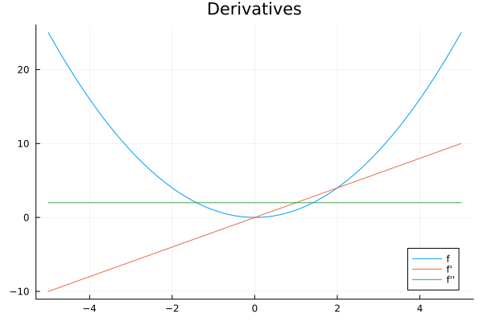

# First Example

## Joint Models
The struct `JointSurvivalModel` allows you to implement joint models. Let us consider a simple example. First we describe a model and generate data. Assume a non-linear mixed effects model for individual ``i \in \{1,2,\dots,100\}``

```math
m_i(t) = t^{a_i} * (1+\cos(b * t)^2),
```
where ``a_i`` is a mixed effects parameter for each individual and ``b`` a population parameter. Next a Weibull survival model with baseline hazard

```math
h_0(t) = \alpha/\theta ( t / \theta)^{\alpha -1}
```

with the two parameters ``\alpha`` and ``\theta``. From these we can build a joint model using the identity link ``id: x \mapsto x`` and link coefficient ``γ``.

```math
h_i(t) = h_0(t) \exp(\gamma * id(m_i(t))) = \alpha/\theta ( t / \theta)^{\alpha -1} * \exp(\gamma * t^{a_i} * (1+\cos(b * t)^2)).
```

In code:
```julia
parametric_m_i(t, i, a, b) = t^(a[i]) * (1+cos(b * t)^2)
parametric_h_0(t, α, θ) = α/θ *(t/θ)^(1-α)
parametric_joint_model(i, a, b, γ, α, θ) = JointSurvivalModel(
    t -> parametric_h_0(t, α, θ),   # baseline hazard function
    γ,                              # link coefficient
    t -> parametric_m_i(t, i, a, b)            # link function
)
```


To simulate data for 100 individuals we assume ``a_i \sim Beta(2,10)`` and ``b = 3, γ = 0.02, \alpha = 1.2, \theta = 50``:
```julia
using Distributions
using JointSurvivalModels
using Random
Random.seed!(222)
n = 100 # number of individuals
a = rand(Product(fill(Beta(10,2), n)))
b = 0.2
γ = 0.05
α = 0.6
θ = 70


m(i) = t -> parametric_m_i(t, i, a, b)
h_0(t) = parametric_h_0(t, α, θ)
joint_models = [JointSurvivalModel(h_0, γ, m(i)) for i in 1:n] # joint models for all individuals
```

Inspecting individual ``1`` and ``2``.


```julia
using Plots
r = range(0,50,100)

lm = plot(r, m(1), title="Longitudinal process", label = "Individual 1", color = :blue)
plot!(lm, r, m(2), label = "Individual 2", color = :green)
```

```julia
sm = plot(r, t-> ccdf(joint_models[1], t), label = "Survival individual 1", title="Joint survival process", color = :blue)
plot!(sm, r, t-> ccdf(joint_models[2], t), label = "Survival individual 2", color = :green)
plot!(sm, r, t-> ccdf(Weibull(1.2,100),t), label = "Baseline survival", color = :black)
```


To simulate longitudinal measurements ``y_{ij}`` for individual ``i`` at time ``t_ij`` we assume a multiplicative error ``y_{ij} \sim N(m_i(t_{ij}), \sigma * m_i(t_{ij}) ), \sigma = 0.15``. Simulate ``9`` longitudinal measurements and survival times for each individual:
```julia
σ = 0.15
t_m = range(1,50,9)
Y = [[rand(Normal(m(i)(t_m[j]), σ * m(i)(t_m[j]))) for j in 1:9] for i in 1:n]
T = [rand(jm) for jm in joint_models]
```
Additionally we assume right-censoring at ``50`` and no measurements after an event:
```julia
Δ = T .< 50       # event indicators
T = min.(T, 50)   # censoring at 50
indices = [findlast(T[i] .>= t_m) for i in 1:n]
Y = [Y[i][1:indices[i]] for i in 1:n] # prune obs after events
scatter!(lm, t_m[1:indices[1]], Y[1], label="obs individual 1", color = :blue)
scatter!(lm, t_m[1:indices[2]], Y[2], label="obs individual 2", color = :green)
vline!(lm, [T[1]], label="Event time ind 1", color = :blue)
vline!(lm, [T[2]], label="Event time ind 2", color = :green)
```



## Modeling in Turing
One application of this module is in bayesian inference frameworks, for example `Turing.jl`. For this we choose a suitable prior distribution for the parameters and use the framework to sample the posterior. This works based on the numerical estimation of the log probability density function.

First the non-linear mixed effects model by itself
```julia
using Turing
# for better performance with multidimensional distributions (mixed effects)
using ReverseDiff
Turing.setadbackend(:reversediff)
Turing.setrdcache(true)

@model function example_longitudinal(Y, t_m)
    n = length(Y)
    
    # longitudianl coef
    a ~ filldist(Beta(10, 2), n)
    b ~ Uniform(0.1, 0.3)
    # multiplicative error
    σ ~ Exponential(0.2)
    # model
    m(i) = t -> parametric_m_i(t, i, a, b)
    # longitudinal likelihood
    for i in 1:n
        n_i = length(Y[i])
        for j in 1:n_i
            Y[i][j] ~ Normal(m(i)(t_m[Int(j)]), σ * m(i)(t_m[Int(j)]))
        end
    end
end

longitudinal_chn = sample(example_longitudinal(Y, t_m), NUTS(), 200)
posterior_means = summarize(longitudinal_chn)[:,2]
a_hat = posterior_means[1:n]
b_hat = posterior_means[101]

```

Now a two step joint model, where we use the posterior mean of the population and mixed effects from the longitudinal model fitted above:

```julia
@model function example_two_step(Y, t_m, T, Δ, a, b)
    n = length(Y)
    
    # survival coef
    α ~ Uniform(0.4,1.2) #0.6
    θ ~ LogNormal(4,0.2) #70
    # joint model coef
    γ ~ Normal(0,0.03)
    # models
    m(i) = t -> parametric_m_i(t, i, a, b)
    h_0(t) = parametric_h_0(t, α, θ)
    joint_models = [JointSurvivalModel(h_0, γ, m(i)) for i in 1:n]

    # survival likelihood
    for i in 1:n
        T[i] ~ censored(joint_models[i], upper = 50 + Δ[i]) # if censored at time 50 then upper = 50
    end
end
# using previously sampled posterior for longitudinal process
two_step_chn = sample(example_two_step(Y, t_m, T, Δ, a_hat, b_hat), NUTS(), 100)

```
Finally a joint model where the posterior of the longitudinal and joint survival model are sampled simultaneously.

```julia
@model function example_joint_model(Y, t_m, T, Δ)
    n = length(Y)
    # longitudinal coef
    a ~ filldist(Beta(10,2), n)
    b ~ Uniform(0.1, 0.3)
    # multiplicative error
    σ ~ Exponential(0.2)
    # survival coef
    α ~ Uniform(0.4,1.2) #0.6
    θ ~ LogNormal(4,0.2) #70
    # joint model coef
    γ ~ Normal(0,0.03)
    # models
    m(i) = t -> parametric_m_i(t, i, a, b)
    h_0(t) = parametric_h_0(t, α, θ)
    joint_models = [JointSurvivalModel(h_0, γ, m(i)) for i in 1:n]
    # longitudinal likelihood
    for i in 1:n
        n_i = length(Y[i])
        for j in 1:n_i
            Y[i][j] ~ Normal(m(i)(t_m[Int(j)]), σ * m(i)(t_m[Int(j)]))
        end
    end
    # survival likelihood
    for i in 1:n
        T[i] ~ censored(joint_models[i], upper = 50 + Δ[i]) # if censored at time 50 then upper = 50
    end
end

joint_model_chn = sample(example_joint_model(Y, t_m, T, Δ), NUTS(), 100)
```

## Maximum Likelihood
This implementation of joint models can also be used for maximum likelihood optimizations. The `Optim.jl` package contains many different optimizers that can be used to find parameters of your model. Here is an example of finding the parameters of the baseline hazard and link coefficient:
```julia
using Optim

function loglikelihood(args)
    result = 0
    m(i) = t -> parametric_m_i(t, i, a, b)
    h_0(t) = parametric_h_0(t, args[1], args[2])
    joint_models = [JointSurvivalModel(h_0, args[3], m(i)) for i in 1:n]
    for i in 1:length(T)
        result += logpdf(censored(joint_models[i], upper = 50 + Δ[i]), T[i])
    end
    return result
end
minprob(args) = - loglikelihood(args)

res = optimize(minprob, [1,100,0.0]) # res.minimizer = 0.5616, 67.0875,  0.0513
```

There is also an interface for MLE and MAP estimations using `Turing.jl` which can be found [here](https://turing.ml/dev/docs/using-turing/guide#maximum-likelihood-and-maximum-a-posterior-estimates). In this specific example the Turing interface does not work, since the Weibull density is not defined for theta equals 0.


## Link functions
In the example above the identity link was used for simplicity. The julia ecosystem contains suitable options to explore link functions. For example we can use ForwardDiff to take derivatives of numeric julia functions:

```julia
using ForwardDiff
f(x) = x^2
Dxf(x) = ForwardDiff.derivative(x ->f(x), x) # first derivative
Dx2f(x) = ForwardDiff.derivative(x ->Dxf(x), x) # second derivative
plot(f, label = "f", title="Derivatives")
plot!(Dxf, label = "f'")
plot!(Dx2f, label = "f''")
```


Another interesting module could be `DifferentialEquations.jl,` which allows to calculate ODEs and PDEs numerically.
